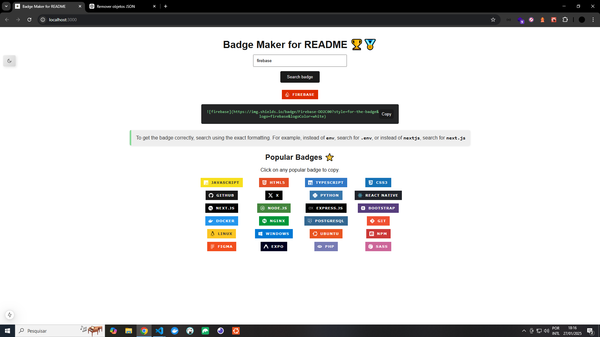

# Learn
Simple tool to generate custom badges in HTML5. Just search, copy and paste the code directly into your README.

# Socials
[](https://twitter.com/t_h_e_u) [](https://t-heu.github.io/) [](https://www.linkedin.com/in/matheusgbatista/)

## 🚀 Techs
    

## 📦 Getting Started

First, run the development server:

Install:
```bash
npm install
# ou
yarn
```

Run:
```bash
npm run dev
# or
yarn dev
# or
pnpm dev
# or
bun dev
```

Open [http://localhost:3000](http://localhost:3000) with your browser to see the result.

## 🖼️ Preview


## 🐛 Problemas e Suporte

Caso encontre algum problema, sinta-se à vontade para abrir uma [issue](https://github.com/t-heu/badge-generator/issues).

## 📄 Licença

Este projeto está sob a licença MIT. Veja o arquivo [LICENSE](LICENSE) para mais detalhes.
